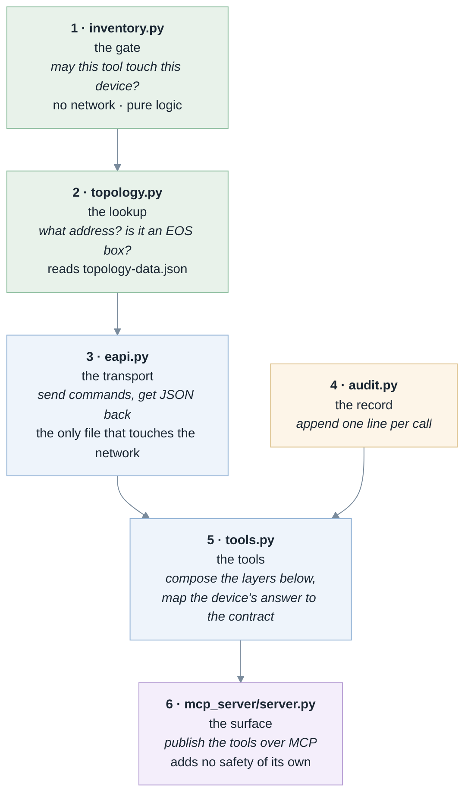
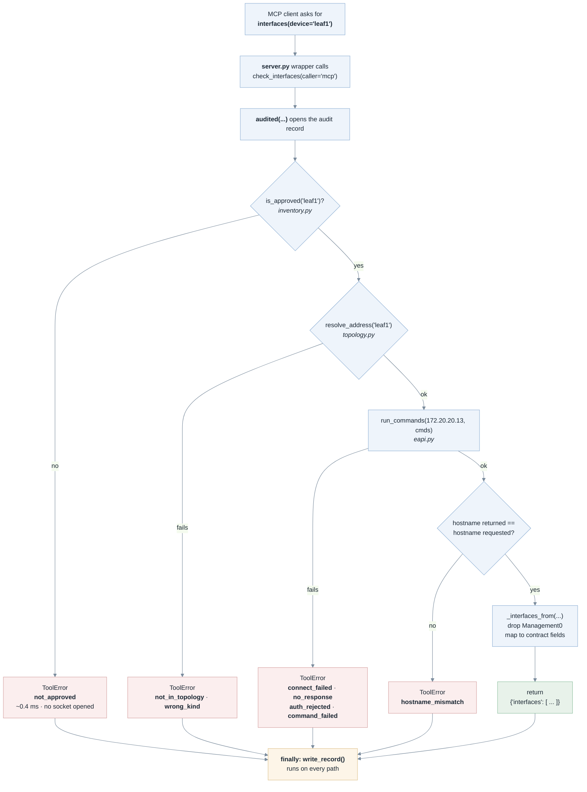

# Build order and call path

Two views of the same codebase. The first is the order the files were written
in and why. The second is what happens on one call at runtime.

They are close to mirror images: the code was built **bottom-up**, and a call
enters at the **top** and falls through the same layers in reverse.

---

## 1. Build order

Each file could be written and tested with nothing above it existing yet,
because no file calls upward.

**Why this order**

| # | File | Built when it was because |
|---|---|---|
| 1 | `inventory.py` | Everything depends on "am I allowed to touch this device". No network, no credentials — if this is wrong, nothing else matters. |
| 2 | `topology.py` | Only an *approved* name is worth resolving. Gate first, lookup second. |
| 3 | `eapi.py` | You cannot connect until you know where to. |
| 4 | `audit.py` | Small and standalone; the tools call it, so it exists before they do. |
| 5 | `tools.py` | Each tool composes the four files below it. |
| 6 | `server.py` | Publishes tools that must already exist and already work. |

---

## 2. Runtime — one call to `check_interfaces('leaf1')`

**Two things this makes visible**

- **Every path ends at `write_record()`.** Approved or refused, connected or
  timed out — the audit line is written. That is the `finally` block, and it is
  why the log can be trusted.
- **Refusals get cheaper the earlier they fire.** `not_approved` costs about
  0.4 ms and never opens a socket; `hostname_mismatch` costs a full round trip.
  Cheapest and most restrictive check first, deliberately.